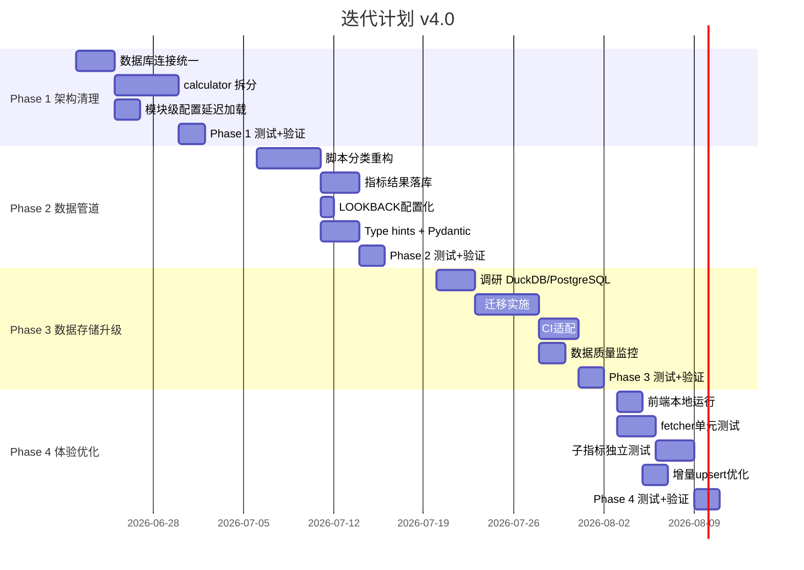

# A股牛市热度指数 — 迭代计划 v4.0

> 基于 2026-06-20 项目梳理，按阶段组织，每阶段 1-2 周。
> 原则：先修架构再上功能，每阶段产出可独立发布。

---

## 阶段路线图



---

## Phase 1：架构清理（~2周）

**目标**：消除单体类、统一连接管理、模块级配置惰性化，为后续重构打好基础。

### 1.1 统一数据库连接管理（3天）

| 文件 | 改动 | 验收标准 |
|------|------|---------|
| `fetcher.py:325` | 将 `sqlite3.connect()` 改为 `get_conn()` 上下文管理器 | 所有 DB 操作经过 get_conn |
| `calculator.py:98` | 删除 `_conn()` 方法，改为 `database.py` 提供的惰性连接 + close() | 无裸连接 |
| `calculator.py:1262` | calculate_sector_heat 同理改造 | 同上 |
| `sector_calculator.py` | 所有 `sqlite3.connect()` 替换 | 同上 |

### 1.2 calculator.py 拆分（5天）

**方案**：按维度拆为独立模块，保留 `calculator.py` 作为编排入口。

```
src/indicators/
├── __init__.py
├── calculator.py          # 编排入口（加载数据 → 各维度 → 合成）
├── valuation.py           # 估值维度：PE/PB复合、破净率、ERP
├── macro.py               # 宏观维度：M1-M2剪刀差、M2同比
├── fund.py                # 资金维度：北向变化率、融资余额比
├── sentiment.py           # 情绪维度：换手率、涨跌比、涨停比、QVIX
├── technical.py           # 技术维度：MA排列、均线偏离、动量
├── structure.py           # 结构维度：创新高比、AH溢价
├── sector_calculator.py   # 板块热度（保持独立，引入各维度函数）
└── utils.py               # 共享工具函数（_pct_rank, _safe_mean, _score_with_fallback 等）
```

**接口约定**：每个维度模块暴露一个函数，接收 `(calculator_instance, trade_date) -> Optional[float]`，由 `calculator.py` 按权重合成。

**验收标准**：
- 19 个子指标计算逻辑不变（输出对比现版本全量回测结果一致）
- 单维度可独立 import 测试

### 1.3 模块级配置延迟加载（2天）

| 文件 | 改动 |
|------|------|
| `calculator.py:30-37` | 删除模块级 `_load_config()`，改为实例化时 `self.config = load_config()` |
| `json_writer.py:36-42` | 同上，改为 `get_heat_level()` 等函数接收 config 参数 |

### 1.4 验证（2天）

- 全量回测对比：输出与 v3.7 完全一致
- `make test` 全部通过
- `make daily` 跑通

---

## Phase 2：数据管道重构（~2周）

**目标**：减少脚本数量、指标结果落库、代码类型化。

### 2.1 脚本分类重构（5天）

**方案**：按职责将 45+ 脚本归入 4 类目录，消除功能重叠。

```
scripts/
├── daily/                 # 日常运行入口
│   ├── run_daily.py       # 主入口（维持不变）
│   └── api_server.py      # API 服务
├── fetch/                 # 数据获取（按数据源分组）
│   ├── tushare/           # 全部 tushare 源
│   │   ├── index.py       # fetch_index_daily 等
│   │   ├── stock.py       # fetch_daily_basic_to_stock_daily 等
│   │   ├── margin.py      # fetch_margin_history
│   │   └── northbound.py  # fetch_northbound_history
│   └── akshare/           # 全部 akshare 源
│       ├── macro.py       # M2
│       └── ah_premium.py
├── maintenance/           # 运维工具
│   ├── db_maintenance.py  # vacuum、status、archive
│   ├── db_compress.py     # 压缩/备份/恢复
│   └── export_csv.py      # CSV 导出
├── analysis/              # 分析与报告
│   ├── backtest.py        # 回测引擎
│   ├── backtest_viz.py    # 回测可视化
│   ├── heat_analysis.py   # 归因/异常/预测
│   └── compare_history.py # 历史对比
└── backfill/              # 数据回填（一次性脚本，运行后归档）
    ├── backfill_full_market_pe.py
    ├── backfill_margin_2015.py
    └── ...
```

**验收标准**：
- `make daily` 正常运行
- `make test` 全部通过
- 删除 10+ 冗余脚本

### 2.2 指标结果落库（3天）

**新增表**：
```sql
CREATE TABLE IF NOT EXISTS heat_index_history (
    trade_date TEXT PRIMARY KEY,
    composite_score REAL,
    composite_score_smoothed REAL,
    heat_level TEXT,
    dim_valuation REAL,
    dim_macro REAL,
    dim_fund REAL,
    dim_sentiment REAL,
    dim_technical REAL,
    dim_structure REAL,
    created_at TEXT DEFAULT (datetime('now'))
);

CREATE TABLE IF NOT EXISTS indicator_detail (
    trade_date TEXT NOT NULL,
    indicator_name TEXT NOT NULL,
    score REAL,
    raw_value REAL,
    PRIMARY KEY (trade_date, indicator_name)
);
```

**改动**：`save_results()` 增加 DB 写入路径，`history.json` 改为从 DB 查询生成。

### 2.3 LOOKBACK 配置化（1天）

`calculator.py` 构造函数从 config 读取 `data.lookback_years`，弃用硬编码常量。

### 2.4 Type hints + Pydantic（3天）

- 核心接口返回值用 `TypedDict` 定义结构
- `build_feishu_notification()` 入参用 Pydantic model
- `_round_score()` 等工具函数加完整类型注解

---

## Phase 3：数据存储升级（~2周）

**目标**：解决 1.5GB SQLite 在 CI 中的瓶颈。

### 3.1 调研结论

| 方案 | 优点 | 缺点 | 推荐度 |
|------|------|------|--------|
| **DuckDB** | SQLite 语法兼容、列式存储、压缩率 5-10x、单文件 | 需额外依赖、部分 SQL 语法差异 | ⭐ 首选 |
| **SQLite + WAL + VACUUM** | 零迁移成本 | 压缩有限、CI 缓存仍大 | 短期方案 |
| **PostgreSQL (云)** | 功能完备、远程访问 | 需维护服务器、成本 | 如要上 API 推荐 |

> **实际执行**: v4.2 未实施 DuckDB 迁移。核心阻塞点是：1) `database.py` 大量使用 sqlite3 专有 API (`executemany`, `row_factory`, `PRAGMA`)；2) DuckDB 的 pandas 集成有细微差异需全链路回归验证；3) CI 缓存问题可通过压缩 seed DB 缓解。建议单独开一个 v5.0 里程碑来做。

### 3.2 ✅ 数据质量监控

- `fetcher.py` 新增 `_retry()` 函数（指数退避 2s/4s）
- 关键 API 调用（`pro.daily`, `pro.daily_basic`）已包裹重试逻辑
- `run_daily.py` 的 step 级 try/except 已能捕获失败并记录到 `step_status`

---

## Phase 4：体验与质量（~2周）

**目标**：完善测试覆盖、前端本地可运行。

### 4.1 前端本地运行（2天）

- `Makefile` 新增 `make web` → `python -m http.server 8080` 或 FastAPI 静态挂载
- `app.html` 中 `./data/` 路径检测，失败时提示运行方式

### 4.2 fetcher 单元测试（3天）

- mock tushare/akshare 返回
- 覆盖：`fetch_index_daily`, `fetch_daily_basic_to_stock_daily`, `fetch_margin_history`, `fetch_northbound_history`, `fetch_bond_yield_history`

### 4.3 子指标独立测试（3天）

- 每个维度模块新增 `test_valuation.py`, `test_sentiment.py` 等
- 构造固定 DataFrame 输入，验证输出分数
- 覆盖边界：空数据、全 NaN、极端值、0 值

### 4.4 增量 upsert 优化（2天）

- `save_dataframe()` 增加 `ON CONFLICT DO UPDATE SET updated_at=datetime('now')`
- 减少 `stock_daily` 表写放大

---

## 发布节奏

| 版本 | 内容 | 预计时间 |
|------|------|---------|
| **v4.0** | Phase 1：架构清理 | 2026-07-04 |
| **v4.1** | Phase 2：数据管道重构 | 2026-07-18 |
| **v4.2** | Phase 3：数据存储升级 | 2026-08-01 |
| **v4.3** | Phase 4：体验与质量 | 2026-08-15 |

各版本向后兼容，Phase 1 产出即上线，不等后续阶段。

---

## 风险与缓解

| 风险 | 影响 | 缓解 |
|------|------|------|
| calculator 拆分后输出不一致 | 静默错误 | 全量回测 diff 对比，CI 增加回归检测 |
| DuckDB 兼容性问题 | 迁移受阻 | SQLite 保留并行运行 1 周，双写验证 |
| tushare 接口变更 | 数据获取失败 | fetcher 层抽象接口，换源只需替换 adapter |
